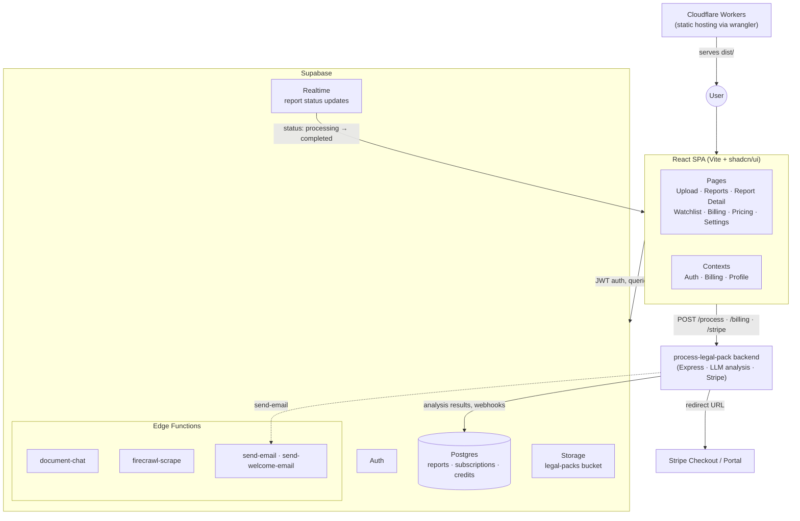

# Asta Legal Insight

Dashboard for [Asta](https://app.useasta.com) — upload property auction legal packs, get AI-generated risk reports, chat with documents, and manage billing. React SPA backed by Supabase and the [process-legal-pack](https://github.com/onurhan1337/process-legal-pack) analysis backend.

## Architecture



### Flow

1. User signs in with Supabase Auth and uploads legal pack PDFs to the `legal-packs` storage bucket.
2. The dashboard calls the backend's `POST /process`; billing (trial credits / subscription usage) is enforced there.
3. The backend analyzes documents and writes `analysis_result` to the `reports` table; Supabase Realtime pushes the status change to the UI.
4. Report detail pages render structured risk sections and offer document chat via the `document-chat` edge function.
5. Checkout and the billing portal are Stripe sessions created by the backend.

## Getting Started

```bash
npm install
cp .env.example .env   # fill in your values
npm run dev
```

Requires a Supabase project (apply `supabase/migrations/`) and a running [process-legal-pack](https://github.com/onurhan1337/process-legal-pack) backend.

## Environment Variables

| Variable | Required | Description |
|---|---|---|
| `VITE_SUPABASE_URL` | ✔ | Supabase project URL |
| `VITE_SUPABASE_PUBLISHABLE_KEY` | ✔ | Supabase anon/publishable key |
| `VITE_BACKEND_URL` | ✔ | process-legal-pack backend URL |
| `VITE_PUBLIC_POSTHOG_KEY` | — | PostHog analytics key |
| `VITE_PUBLIC_POSTHOG_HOST` | — | PostHog host |

All values here ship in the client bundle — never put server-side secrets (service role keys, Stripe secret keys, Resend keys) in this project. Edge function secrets (`RESEND_API_KEY`, etc.) are set with `supabase secrets set`.

## Scripts

```bash
npm run dev      # local dev server
npm run build    # production build to dist/
npm run lint     # eslint
npm run preview  # preview the production build
```

## Deployment

Static build served by a minimal Cloudflare Worker (`worker.ts`, `wrangler.toml`):

```bash
npm run build
npx wrangler deploy
```

Supabase edge functions deploy with `supabase functions deploy <name>`.

## Tech Stack

- React 18 + TypeScript + Vite
- shadcn/ui + Tailwind CSS
- Supabase (Auth, Postgres, Storage, Realtime, Edge Functions)
- TanStack Query, React Router
- Stripe (via backend), PostHog

## License

[MIT](LICENSE)
